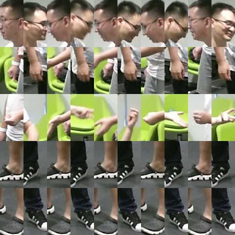
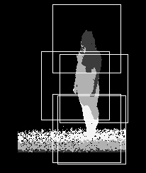
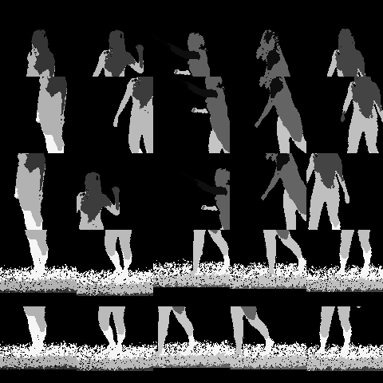

# HCMFN

**Human-Centric Multimodal Fusion Network for Robust Action Recognition**

# Abstract

In this work, we propose an innovative skeleton-guided multimodal data fusion methodology that transforms depth, RGB, and optical flow modalities into human-centric images (HCI) based on keypoint sequences. Building upon this foundation, we introduce a human-centric multimodal fusion network (HCMFN),  which can comprehensively extract the action patterns of different modalities. Our model can enhance performance in combination with skeleton-based techniques, delivering significant improvements with rapid inference speed.

Extensive experiments on two large-scale multimodal datasets, namely NTU RGB+D and NTU RGB+D 120, validate the capacity of HCMFN to bolster the robustness of skeleton-based methods in two challenging HAR tasks:

(1) discriminating between actions with subtle inter-class differences, and 

(2) recognizing actions from varying viewpoints.

This work has been accepted by **ESWA**. Please enlighten me with your instructions.

| Date   | Status |
|--------|--------|
|May 31, 2023|Manuscript submitted to journal|
|Aug 04, 2023|Revised|
|Aug 24, 2023|Revision submitted to journal|
|Oct 04, 2023|Revised|
|Oct 11, 2023|Revision submitted to journal|
|Oct 21, 2023|**Accepted**|

[Article available online](https://www.sciencedirect.com/science/article/pii/S0957417423028166?via%3Dihub)

# Acknowledgements

 This work is based on the following three works：

 **MMNet**, TPAMI 2022, [Original code](https://github.com/bruceyo/MMNet)
 
 **PoseC3D**, CVPR 2022, [Original code](https://github.com/kennymckormick/pyskl)

 **MS-G3D**, CVPR 2020, [Original code](https://github.com/kenziyuliu/MS-G3D)

 Thanks to the original authors for their work! Although our work represents only a modest improvement upon existing studies, we remain optimistic that it can provide valuable enlightenment to someone.

 Meanwhile, we are very grateful to the creators of these two datasets, i.e., NTU RGB+D and NTU RGB+D 120. Your selfless work has made a great contribution to the computer vision community!

 Last but not least, the authors will be very grateful for the selfless and constructive suggestions of the reviewers.

# Update notice
If you need to download on **Google Drive**, please contact me. Now you can also download everything on **Baidu Cloud**.

# Ablation studies

The detailed ablation studies on NTU RGB+D (CS/CV) and NTU RGB+D 120 (XSub/XSet) are as follows.

| Number | Input |  Backbone | CS(\%) | CV(\%) | XSub(\%) | XSet(\%) |
|--------|--------|--------|--------|--------|--------|--------|
| \#1    |  $J$                | PoseC3D        | 93.7 | 96.5 | 85.9 | 89.7 |
| \#2    |  $B$                | PoseC3D        | 93.4 | 96.0 | 85.9 | 89.7 |
| \#3    |  $J+B$              | PoseC3D        | 94.1 | 96.8 | 86.6 | 90.2 |
| \#4    |  $J$                | MS-G3D         | 88.4 | 94.2 | 81.5 | 82.3 |  
| \#5    |  $B$                | MS-G3D         | 89.5 | 94.0 | 85.0 | 86.4 |  
| \#6    |  $S$                | \#4+\#5        | 90.9 | 95.2 | 86.4 | 87.6 |
| \#7    |  $R$                | ResNet18       | 77.8 | 84.3 | 70.2 | 70.3 |  
| \#8    |  $O$                | ResNet18       | 63.7 | 69.2 | 54.5 | 55.6 |  
| \#9    |  $D$                | ResNet18       | 78.4 | 76.6 | 72.6 | 71.2 |  
| \#10   |  $S+R$              | \#3+\#7        | 94.8 | 97.7 | 88.4 | 91.8 |
| \#11   |  $S+D$              | \#3+\#9        | 94.5 | 97.2 | 88.2 | 91.5 | 
| \#12   |  $S+R$              | \#6+\#7        | 92.8 | 96.7 | 89.5 | 90.5 | 
| \#13   |  $S+D$              | \#6+\#9        | 92.2 | 96.0 | 89.1 | 90.0 |
| \#14   |  $R+O$              | \#7+\#8        | 83.4 | 88.3 | 77.0 | 81.6 |
| \#15   |  $R+D$              | \#7+\#9        | 85.5 | 88.3 | 81.2 | 83.8 | 
| \#16   |  $S+R+O$            | \#3+\#7+\#8    | 94.9 | 97.9 | 88.9 | 92.0 | 
| \#17   |  $S+R+D$            | \#3+\#7+\#9    | 95.0 | 97.9 | 89.7 | 92.5 | 
| \#18   |  $S+R+O$            | \#6+\#7+\#8    | 93.0 | 96.9 | 89.8 | 90.9 | 
| \#19   |  $S+R+D$            | \#6+\#7+\#9    | 93.3 | 96.9 | 90.5 | 91.5 |
| \#20   |  $R+O+D$            | \#7+\#8+\#9 (HCMFN)    |87.7 | 90.5 | 83.4 | 83.8 |
| \#21   |  $S+R+O+D$          | \#3+\#7+\#8+\#9 (HCMFN)| **95.2** | **98.0** | 89.9 | **92.7** |
| \#22   |  $S+R+O+D$          | \#6+\#7+\#8+\#9 (HCMFN)| 93.5 | 97.1 | **90.7** | 91.7 |

$J$, $B$ represent the feature representations of jonits and bones, respectively. $S$ stands for $J$ and $B$ together. $R$, $O$ and $D$ denote HCI of RGB, optical flow and depth, respectively. + indicates socre fusion. Bold accuracy indicates the best.

# How to reproduce this work?

 To reproduce this work, you must complete several stages, including

 **Step 1**, [Build environment](#build-environment)

 **Step 2**, [Download dataset and preprocess](#download-dataset-and-preprocess) 
  
 **Step 3**, [Train and test model](#train-and-test-model)
 
 **Step 4**, [Ensemble results](#ensemble-results)
 
 If you only need to quickly reproduce the experimental results in the article, please follow **Step 4**.

 # Build environment
 
 HCMFN has been enhanced by incorporating code from PoseC3D, MS-G3D and MMNet. To evaluate its effectiveness in different contexts, we conduct experiments in various environments. Specifically, we utilize the environment of [MMLab](https://github.com/kennymckormick/pyskl) to process the input of 3D heatmap volumes, while the environment of [MMNet](https://github.com/bruceyo/MMNet) is employed for handling the input of HCI and spatiotemporal skeleton graph (for MS-G3D).

 # Download dataset and preprocess
 
 We conduct experiments on two large multimodal action datasets, namely NTU RGB+D and NTU RGB+D 120. Download the dataset first, and then preprocess to generate mid-level features.
 
 ## Download dataset
 
 Request permission at RoseLab to download both datasets. [Link](https://rose1.ntu.edu.sg/dataset/actionRecognition/)
 
 Download data for these modalities: Skeleton, Masked depth maps, RGB videos.
 
 ## Preprocess
 
 The [3D heatmap volumes](https://github.com/kennymckormick/pyskl/blob/main/tools/data/README.md) are available for download in PoseC3D. For convenience, we provide HCI for depth maps, RGB videos and optical flow modalities. Additionally, our code allows you to generate HCI for different modalities as per your requirements.

 The [spatiotemporal skeleton graph](https://github.com/bruceyo/MMNet) can be generated by the source code of MS-G3D. If you want to test the view-invariant property of the model, please change the 'training_cameras' setting in the 'ntu_gendata.py' file.
 
 **NTU RGB+D HCI**
 
 | HCI modalities | Baidu Cloud Link |  Google Drive Link |
 |----------------|------------------|--------------------| 
 | RGB HCI         | [Link](https://pan.baidu.com/s/1gogL--PS7UA26xmrKn52OA?pwd=t061) | - |
 | Optical flow HCI| [Link](https://pan.baidu.com/s/1evggahe3mbbilrMR5Y_gYg?pwd=ffce) | - |
 | Depth HCI       | [Link](https://pan.baidu.com/s/1mE2ZloU3tD4Y7l708xzpVg?pwd=1p98) | - |
 
 

  
  &nbsp;&nbsp;&nbsp;&nbsp;
  

 

  <em>Rock-paper-scissors. Left: RGB video. Right: RGB HCI</em>

 

  
  &nbsp;&nbsp;&nbsp;&nbsp;
  

 

  <em>Throw. Left: Masked depth maps. Right: Depth HCI</em>

 In view of the huge amount of data generated during framing, for each RGB video, we use the method of framing and deleting to construct RGB and optical flow HCI.
 
 Although NTU RGB+D has two benchmarks, note that we store all training samples and testing samples in the 'train' folder.
 
 Since we use flownet2 to generate optical flow HCI, you must download the pretrained model (173MB). [Baidu Cloud](https://pan.baidu.com/s/1WkT2e3O5RECTYxYeeQPKGQ?pwd=cr5w)

 For example, you can generate RGB and optical flow HCI:
 
    `python ntu60_gen_HCI.py`
    
 **Pay attention to modify the file path.**

| File path parameter    | Description         |
|------------------------|---------------------|
| skeletons_path         |  Raw skeleton data  |
| frames_path            |  Raw rgb video      |
| ignored_sample_path    |  Samples that need to be ignored (.txt) |
| out_folder             |  RGB HCI output file |
| out_folder_opt         |  Optical flow HCI output file |
    
 Additionally, you can generate depth HCI：
 
    `python ntu60_gen_depth_HCI.py`
 
 # Train and test model
 
 Each single-stream model is trained first, and then the learned model parameters are used for testing.
 
 Each data stream needs to be trained separately. For $J$ and $B$, please refer to the tutorial of PoseC3D and MS-G3D. Here we introduce the training method about HCI.
 
 For RGB HCI:

    `python main.py`

We use the official code of [2s-AGCN](https://github.com/lshiwjx/2s-AGCN) or MS-G3D to generate labels for different benchmarks. You can also use these labels directly.

**Pay attention to modify the file path.**

| File path parameter    | Description         |
|------------------------|---------------------|
| data_path              |  Label file - default='data'                 |
| dataset                |  Label file - Dataset, i.e., ntu or ntu120   |
| dataset_type           |  Label file - Benchmark, i.e., xsub or xview |
| output                 |  Output file        |
| rgb_images_path        |  RGB HCI file       |

 For optical flow HCI:
 
    `python main_flow.py`
 
 For depth HCI:

    `python main_depth.py`

 # Ensemble results
 
 Perform weighted score fusion. Here we use the highest score finally obtained by each modality single-stream input for fusion. It is worth noting that the best results are not necessarily obtained from the fusion of these highest scores. Please try it yourself.
 
 **You can quickly reproduce the experimental results in the article based on the content of this part only.**

 Due to the upload file size limit (25MB), we store ensemble-related files (368MB) in [Baidu Cloud](https://pan.baidu.com/s/1mY2BWLJqxprsQ4cZB2-SEw).
 
 The files are arranged as follows:
 
         -ensemble\  
          -ntu60 
          -ntu120
          -ensemble60_xsub.py
          -ensemble60_xview.py
          -ensemble120_xset.py
          -ensemble120_xsub.py
          
 The four .py files correspond to the score fusion of the four benchmarks. You can change the alpha to adjust the weights for different modalities.
 
 For example, you can ensemble the results of the XSub, one of the benchmark of NTU RGB+D:
 
    `python ensemble60_xsub.py`
    
# Contact

If you find that the above description is not clear, or you have other issues that need to be communicated when conducting the experiment, please leave a message on Github.

Feel free to contact me via email:

    `zeshenghu@njnu.edu.cn`
